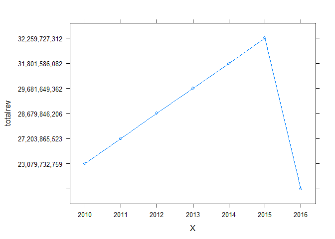
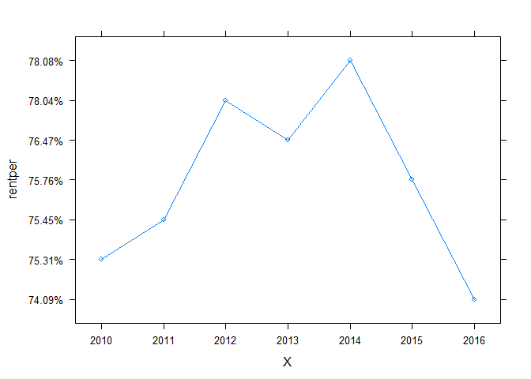
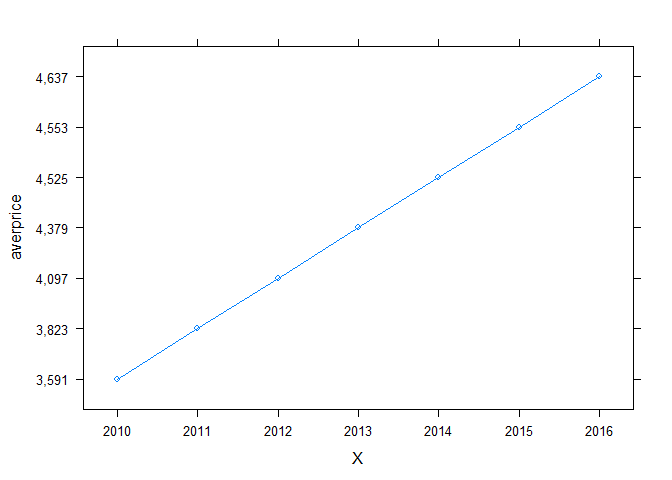
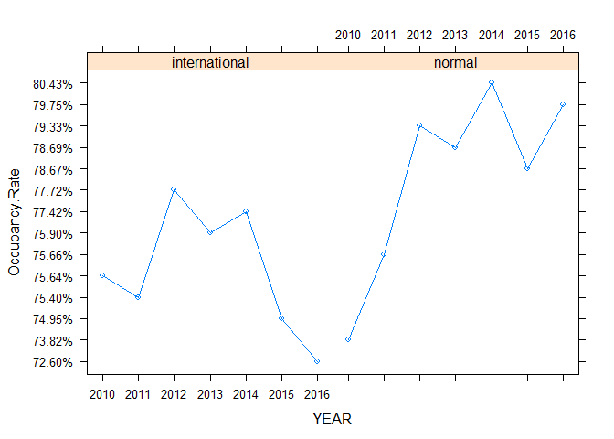
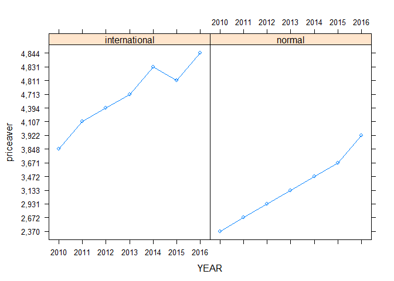

Final project
================

旅館營運報表
------------

``` r
hot_ser_10 <- read.csv("C:/Users/Administrator/Desktop/bigdata final/123/旅館營運報表2010-1~12.CSV")
hot_ser_11 <- read.csv("C:/Users/Administrator/Desktop/bigdata final/123/旅館營運報表2011-1~12.CSV")
hot_ser_12 <- read.csv("C:/Users/Administrator/Desktop/bigdata final/123/旅館營運報表2012-1~12.CSV")
hot_ser_13 <- read.csv("C:/Users/Administrator/Desktop/bigdata final/123/旅館營運報表2013-1~12.CSV")
hot_ser_14 <- read.csv("C:/Users/Administrator/Desktop/bigdata final/123/旅館營運報表2014-1~12.CSV")
hot_ser_15 <- read.csv("C:/Users/Administrator/Desktop/bigdata final/123/旅館營運報表2015-1~12.CSV")
hot_ser_16 <- read.csv("C:/Users/Administrator/Desktop/bigdata final/123/旅館營運報表2016-1~3月.CSV")
```

國外來台觀光人口成長
--------------------

``` r
for_fundata_1 <- read.csv("C:/Users/Administrator/Desktop/bigdata final/123/國外來台觀光人口成長-1.CSV")
for_fundata_2 <- read.csv("C:/Users/Administrator/Desktop/bigdata final/123/國外來台觀光人口成長-2.CSV")
for_fundata_3 <- read.csv("C:/Users/Administrator/Desktop/bigdata final/123/國外來台觀光人口成長-3.CSV")
for_fundata_4 <- read.csv("C:/Users/Administrator/Desktop/bigdata final/123/國外來台觀光人口成長-4.CSV")
for_fundata_5 <- read.csv("C:/Users/Administrator/Desktop/bigdata final/123/國外來台觀光人口成長-5.CSV")
for_fundata_6 <- read.csv("C:/Users/Administrator/Desktop/bigdata final/123/國外來台觀光人口成長-6.CSV")
hot1016_pic1<- read.csv("C:/Users/Administrator/Desktop/bigdata final/1016hot_pic1.CSV")
hot1016_pic2<- read.csv("C:/Users/Administrator/Desktop/bigdata final/1016hot_pic2.CSV")
hot1016_pic3<- read.csv("C:/Users/Administrator/Desktop/bigdata final/1016hot_pic3.CSV")

interno_pic1<- read.csv("C:/Users/Administrator/Desktop/bigdata final/1016interno_pic.CSV")
interno_pic2<- read.csv("C:/Users/Administrator/Desktop/bigdata final/1016interno2_pic.CSV")
```

``` r
#if(!require('rgdal')){#forfortify()
#install.packages("rgdal");
library(rgdal)
```

    ## Loading required package: sp

    ## rgdal: version: 1.1-10, (SVN revision 622)
    ##  Geospatial Data Abstraction Library extensions to R successfully loaded
    ##  Loaded GDAL runtime: GDAL 2.0.1, released 2015/09/15
    ##  Path to GDAL shared files: C:/Users/Administrator/Documents/R/win-library/3.3/rgdal/gdal
    ##  Loaded PROJ.4 runtime: Rel. 4.9.2, 08 September 2015, [PJ_VERSION: 492]
    ##  Path to PROJ.4 shared files: C:/Users/Administrator/Documents/R/win-library/3.3/rgdal/proj
    ##  Linking to sp version: 1.2-3

``` r
#}

#if(!require('rgeos')){#forfortify()
#install.packages("rgeos");
library(rgeos)
```

    ## rgeos version: 0.3-19, (SVN revision 524)
    ##  GEOS runtime version: 3.5.0-CAPI-1.9.0 r4084 
    ##  Linking to sp version: 1.2-3 
    ##  Polygon checking: TRUE

``` r
#}

#if(!require('maptools')){#forreadShapeSpatial()
#install.packages("maptools");
library(maptools)
```

    ## Checking rgeos availability: TRUE

``` r
#}


library(sp)

newtpe_map<-readShapeSpatial("C:/Users/Administrator/Desktop/bigdata final/NEWTPE_MAP/新北市區界.shp")
names(newtpe_map)
```

    ##  [1] "AREA"     "ADMIT"    "ADMIT_ID" "TM2X"     "TM2Y"     "MAX_X"   
    ##  [7] "MAX_Y"    "MIN_X"    "MIN_Y"    "PID"      "PTID"     "PNAME"   
    ## [13] "PTNAME"

``` r
library(ggplot2)
head(newtpe_map$ADMIT_ID)
```

    ## [1] 23 21 02 09 13 03
    ## 29 Levels: 01 02 03 04 05 06 07 08 09 10 11 12 13 14 15 16 17 18 19 ... 29

``` r
newtpe_map.df<-fortify(newtpe_map, region ="ADMIT_ID")
head(newtpe_map.df,10)
```

    ##        long     lat order  hole piece id group
    ## 1  294748.9 2764968     1 FALSE     1 01  01.1
    ## 2  294740.9 2764980     2 FALSE     1 01  01.1
    ## 3  294694.5 2765059     3 FALSE     1 01  01.1
    ## 4  294686.9 2765060     4 FALSE     1 01  01.1
    ## 5  294618.6 2764984     5 FALSE     1 01  01.1
    ## 6  294602.8 2764961     6 FALSE     1 01  01.1
    ## 7  294573.2 2764904     7 FALSE     1 01  01.1
    ## 8  294521.0 2764836     8 FALSE     1 01  01.1
    ## 9  294497.0 2764798     9 FALSE     1 01  01.1
    ## 10 294479.6 2764739    10 FALSE     1 01  01.1

Including Plots
---------------

You can also embed plots, for example:

``` r
#library(RColorBrewer)

#newtpe_map.df$long<-as.numeric(newtpe_map.df$long)
#newtpe_map.df$lat<-as.numeric(newtpe_map.df$lat)

#TaipeiMap<-get_map(location=c(121.43,24.93,121.62,25.19),zoom=14,maptype='watercolor')

#newtpemap <-ggmap(TaipeiMap) + geom_polygon(data = newtpe_map.df, aes(x = newtpe_map.df$long, y = newtpe_map.df$lat, group = group ),color = "black", size = 0.25)+coord_map()+scale_fill_gradientn(colours = brewer.pal(9,"Reds"))+theme_void()+labs(title = "2 Taipei")

#newtpemap
```

北區旅店旅館10年至16年，總營業收入趨勢圖。
==========================================

``` r
library(lattice)
library(datasets)

xyplot(totalrev~X,data=hot1016_pic1,type = "b")
```

 \#北區旅店旅館10年至16年，住用率趨勢圖。

``` r
library(lattice)
library(datasets)
xyplot(rentper~X,data=hot1016_pic2,type = "b")
```

 \#北區旅店旅館10年至16年，平均房價趨勢圖。

``` r
library(lattice)
library(datasets)
xyplot(averprice~X,data=hot1016_pic3,type = "b")
```

 \#北區國際與一般旅館10年至16年，平均入住率。

``` r
library(lattice)
library(datasets)
xyplot(Occupancy.Rate~YEAR|variable,data=interno_pic1, type="b",layout=c(2,1))
```

 \#北區國際與一般旅館10年至16年，平均房價。

``` r
library(lattice)
library(datasets)
xyplot(priceaver~YEAR|variable,data=interno_pic2, type="b",layout=c(2,1))
```



Note that the `echo = FALSE` parameter was added to the code chunk to prevent printing of the R code that generated the plot.
