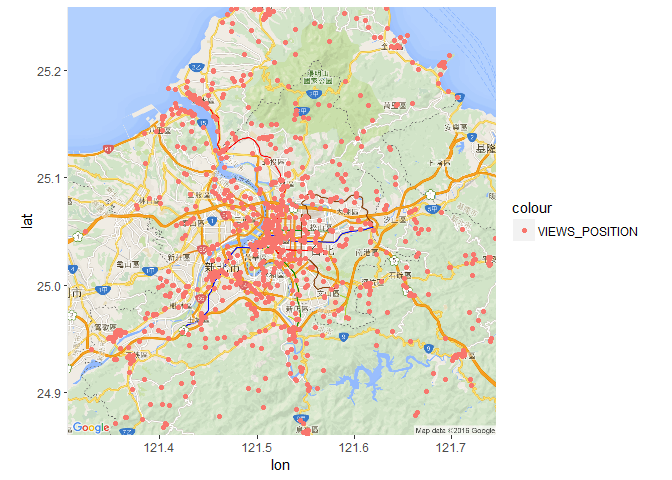

Untitled
================

讀黨
====

``` r
library(jsonlite)
url<-'C:/Users/Administrator/Desktop/bigdata final/景點/view/data.json'
DTPE_view <- fromJSON(url, flatten = TRUE)
```

雙北景點分布
============

``` r
library(ggmap)
```

    ## Loading required package: ggplot2

``` r
twmap.n <- get_map(c(121.43,24.93,121.62,25.19), zoom = 11,language = "zh-TW",maptype = 'roadmap')
```

    ## Warning: bounding box given to google - spatial extent only approximate.

    ## converting bounding box to center/zoom specification. (experimental)

    ## Map from URL : http://maps.googleapis.com/maps/api/staticmap?center=25.06,121.525&zoom=11&size=640x640&scale=2&maptype=roadmap&language=zh-TW&sensor=false

``` r
DTPE_view$longitude<-as.numeric(DTPE_view$longitude)
DTPE_view$latitude<-as.numeric(DTPE_view$latitude)

HotelMap = ggmap(twmap.n)+ geom_point(data=subset(DTPE_view), aes(x=DTPE_view$longitude, y=DTPE_view$latitude,color="VIEWS_POSITION"))

HotelMap
```

    ## Warning: Removed 215 rows containing missing values (geom_point).


